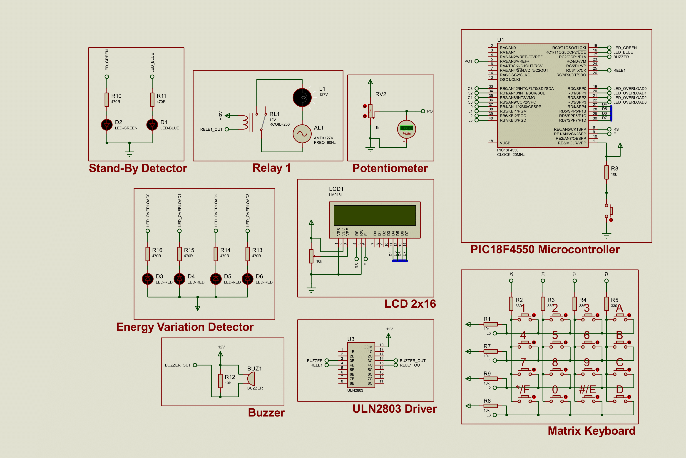

# Electrical Energy Consumption Monitoring and Control System

## Project Overview

This project presents an energy monitoring system developed using the PIC18F4550 microcontroller and simulated in the Proteus environment. The device is designed to measure electrical parameters (current and voltage), which are simulated via a potentiometer for demonstration purposes. From these measurements, the system calculates instantaneous power, cumulative energy consumption in kilowatt-hours (kWh), and the estimated monetary cost based on a user-configurable tariff.

The system serves as a comprehensive and interactive tool, featuring a robust user interface with a 2x16 LCD and a 4x4 matrix keypad. This interface allows for real-time data visualization and configuration of essential parameters, such as the energy tariff and a security password.

To ensure the safety of the system and the connected load, a password-protected security layer controls access to critical functions and is required to reset the system after an overload event. The PIC's internal EEPROM is utilized for non-volatile storage of the user-defined password, ensuring settings are retained even after a power cycle.

## Key Features

*   **Real-Time Monitoring:** Continuous measurement of simulated current and voltage.
*   **Energy Analytics:** Calculates instantaneous power (Watts), cumulative energy consumption (kWh), and total cost.
*   **Interactive User Interface:** A 2x16 LCD displays data and configuration menus.
*   **User Input:** A 4x4 matrix keypad is used for menu navigation, password entry, and tariff configuration.
*   **Visual and Audible Alert System:**
    *   **Energy Variation Detector:** Four red LEDs visually indicate the magnitude of current spikes across different threshold levels.
    *   **Stand-By Detector:** Green and blue LEDs indicate the operational state of the load (e.g., On, Standby, or Off).
    *   **Buzzer:** Provides an audible alert in response to excessive energy consumption or critical faults.
*   **Security and Protection:**
    *   **Password System:** Protects access to the settings menu and is required to re-enable the system after an overload trip. The default password is **"1234"**.
    *   **Non-Volatile Memory:** The user-set password is securely stored in the PIC's internal EEPROM.
    *   **Overload Protection:** A 12V relay, driven by a ULN2803 driver, controls the external load (a 127V lamp in the schematic). The relay is automatically deactivated during a severe overload event to protect the connected appliance.

## Circuit Analysis (Proteus Schematic)

The Proteus schematic details the interconnection between the PIC18F4550 microcontroller and its peripheral components.

*   **Microcontroller (U1 - PIC18F4550):** The central processing unit of the project, operating with a 20MHz external crystal. Its ports are configured as follows:
    *   **PORTA (`RA0/AN0`):** Connected to the wiper of a potentiometer (RV2). This potentiometer simulates the analog output of a sensor, allowing the user to vary the "current" and "voltage" values in the simulation to test the system's logic.
    *   **PORTB (`RB0-RB7`):** Interfaced with the 4x4 matrix keypad. `RB0-RB3` are configured as outputs to scan the keypad columns, while `RB4-RB7` are inputs (with internal pull-ups enabled) to read the rows.
    *   **PORTC:**
        *   `RC0` & `RC1`: Drive the Stand-By Detector LEDs (Green and Blue).
        *   `RC2`: Outputs the signal to the buzzer via the ULN2803 driver.
        *   `RC6`: Outputs the control signal for the relay via the ULN2803 driver.
    *   **PORTD:**
        *   `RD0-RD3`: Control the four red LEDs of the Energy Variation Detector.
        *   `RD4-RD7`: Connected to the LCD data pins (D4-D7) for communication in 4-bit mode.
    *   **PORTE:**
        *   `RE0` & `RE1`: Connected to the LCD control pins `RS` (Register Select) and `E` (Enable).
        *   `RE3/MCLR`: Connected to a push-button for an external Master Clear (Reset), with a pull-up resistor.

*   **Display (LCD1 - 2x16 LCD):** Displays all information to the user. A 10k potentiometer is connected to the `VEE` pin for contrast adjustment.

*   **Driver (U3 - ULN2803):** A Darlington transistor array that functions as a current driver. It is used to interface the low-current PIC I/O pins with higher-current loads like the relay coil (`RELE1_OUT`) and the buzzer (`BUZZER_OUT`). This is a robust design practice that isolates and protects the microcontroller.

*   **Relay (Relay 1):** A 12V relay (RL1) whose normally-open contacts are placed in series with a 127V/60Hz AC source (ALT) and a lamp (L1). When the PIC's `RC6` pin goes high, the ULN2803 energizes the relay coil, closing the contacts and powering the lamp.

*   **LED Indicators:**
    *   **Stand-By (D1, D2):** Blue and Green LEDs signal the load's power consumption state.
    *   **Energy Variation (D3-D6):** Four red LEDs light up sequentially to indicate the severity of a current surge.

*   **Matrix Keypad:** Allows user interaction for navigation and data entry. External pull-up resistors on the columns and internal pull-ups on the rows ensure stable logic levels.

## Source Code Analysis (`main.c`)

The C code, developed for the XC8 compiler, implements the complete system logic.

*   **Main Structure (`main()`):** The main loop manages the primary user interface, displaying an initial screen that allows the user to start monitoring (`main_screen`) or enter the settings menu (`config_screen`).

*   **Initialization (`initSystem()`):** This function configures all necessary PIC registers, including I/O ports (TRIS), the Analog-to-Digital Converter (ADCON), Timer0 (T0CON), and global interrupts. Crucially, it calls `assign_default_password()` to write the default password "1234" to the EEPROM on the first power-on.

*   **Interrupt Service Routine (`isr()`):** The system relies heavily on interrupts for real-time, non-blocking tasks.
    *   **ADC Interrupt (`ADIF`):** Triggered upon completion of an A/D conversion. It continuously reads the potentiometer value, updates the `current` and `voltage` variables, and calls `detect_peak()` to check for surges.
    *   **Timer0 Interrupt (`TMR0IF`):** Configured to overflow approximately every 1 second. It acts as the system's "heartbeat," responsible for:
        *   Calculating energy consumption in Watt-seconds and converting it to kWh.
        *   Updating the estimated cost.
        *   Managing the logic for the standby and alert LEDs.

*   **Password and EEPROM Management:**
    *   The low-level functions `EEPROM_Write()` and `EEPROM_Read()` handle byte-level access to the internal non-volatile memory.
    *   `check_password()` compares user input against the value stored in the EEPROM.
    *   `set_password()` allows the user to define a new password.

*   **Alert Logic (`send_alert()`):** This function is the core of the protection system. Based on the calculated current differential (`current_diff`), it illuminates a corresponding number of red LEDs. If the variation is critical (defined as >25A in the code), it triggers a system lockdown: the relay is opened, the ADC is halted, and the system prompts for a password to be re-armed.

## How to Use the System (In Proteus Simulation)

1.  **Start Simulation:** Run the simulation. The LCD will display the initial screen with options "1-Start" and "2-Settings".
2.  **Simulate Input:** Adjust the **RV2** potentiometer to simulate changes in current and voltage levels.
3.  **Begin Monitoring:** Press '1' on the keypad. The main screen will now cycle through three displays every 4 seconds, showing:
    *   Current (A) and Voltage (V)
    *   Instantaneous Power (W) and Total Consumption (kWh)
    *   Total Cost ($)
4.  **Access Settings:** From the initial screen, press '2' to enter the settings menu.
5.  **Configure Tariff:** In the settings menu, press '2'. Use the numeric keys to enter a new tariff value. Use the '\*' key for the decimal point and 'A' to confirm.
6.  **Manage Password:** In the settings menu, press '1'. You can test the current password or set a new one. The default password is **1234**.
7.  **Test Overload Protection:** Rapidly increase the potentiometer's value to simulate a large current spike. Observe the "Energy Variation Detector" LEDs light up. If the spike is large enough, the relay will click off (the lamp will extinguish), all 4 red LEDs will flash, and the system will lock and prompt for a password. Enter "1234" (or your custom password) to unlock the system and re-engage the relay.

